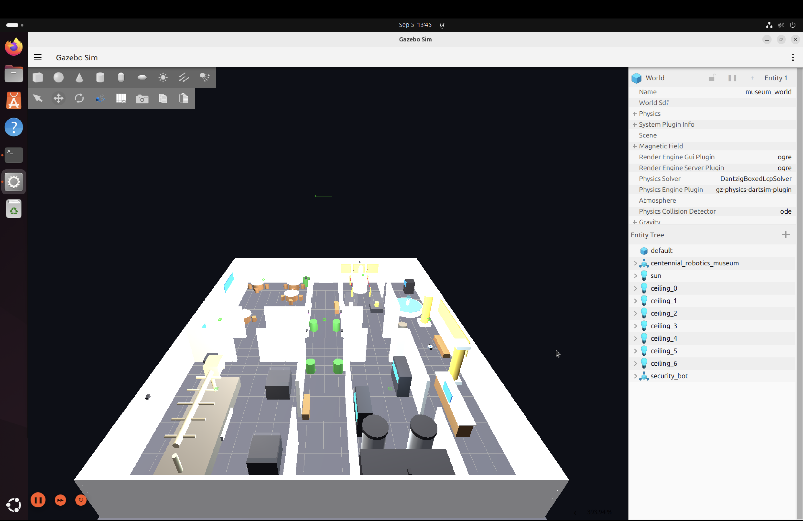
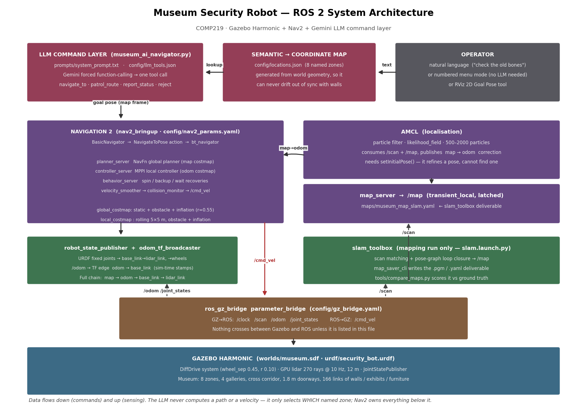

# Museum Security Robot — Autonomous Navigation in ROS 2

COMP219 project. A differential-drive security robot patrols a simulated
museum, localises with AMCL against a slam_toolbox map, plans and executes
paths with Nav2, and takes its orders from a Gemini LLM that translates plain
English into navigation goals.


*The simulated museum — galleries, corridors, and the differential-drive
security robot (bottom center) — running in Gazebo.*



---

## 1. Quick start

```bash
# build
cd ~/ros2_ws/src
cp -r /path/to/museum_security_robot .
cd ~/ros2_ws
rosdep install --from-paths src --ignore-src -r -y
colcon build --packages-select museum_security_robot
source install/setup.bash

# demo (terminal 1) — Gazebo + Nav2 + RViz
ros2 launch museum_security_robot museum_demo.launch.py

# AI command console (terminal 2)
export GEMINI_API_KEY='your-key'
ros2 launch museum_security_robot llm_navigator.launch.py
```

On an ARM64 VM with software rendering, add `render_engine:=ogre` — `ogre2`
needs a real GPU and will either crash or run at a fraction of real time.

---

## 2. What to say to the AI

The LLM reasons about the *situation* you describe, not keywords. None of
these prompts contain a location name, and all of them work:

| What you type | Where it goes | Why |
|---|---|---|
| `I think someone is messing with the servers` | ai_innovation_wing | server hardware lives there |
| `Did I leave my backpack near the old bones?` | dinosaur_hall | "old bones" = the T-rex |
| `There's a kid climbing on the marble figure` | renaissance_gallery | the marble statue |
| `Someone reported a spill where people eat` | cafeteria | food service area |
| `Somebody just walked in the front door` | main_lobby | visitor entrance |
| `Is anyone trying to sneak out the back?` | west_fire_exit | emergency exit |
| `Head back to the monitoring station` | security_office | control room |
| `Park in the middle and stand by` | central_atrium | corridor crossroads |

Multi-stop routes trigger `patrol_route` instead:

| What you type | Route |
|---|---|
| `Sweep the west half of the building` | ai_innovation_wing → west_fire_exit → dinosaur_hall |
| `Check both galleries` | renaissance_gallery → dinosaur_hall |
| `Do a full round of the museum` | all eight zones in order |
| `Walk the perimeter then come back to base` | outer zones → security_office |

Questions don't move the robot:

| What you type | Result |
|---|---|
| `Where are you right now?` | `report_status` — reports pose, stays put |
| `What rooms can you reach?` | `report_status` — lists zones |
| `Order me a pizza` | `reject_command` — declines, does **not** guess |

Console commands: `list`, `menu`, `exit`.

**Design note worth defending in your demo:** if the API call fails, the robot
does **nothing** and prints `LLM UNAVAILABLE`. The old version caught every
exception and drove to the lobby, which meant a dropped network connection was
indistinguishable from a correct decision. A wrong destination that looks
correct is worse than an honest refusal.

---

## 3. The museum

24 × 20 m, eight named zones, walls and 1.8 m doorways that force real
planning rather than driving across open floor.

```
 y=+10  +------------------+-----+------------------+
        |  DINOSAUR HALL   | SEC |    CAFETERIA     |
        |  T-rex, fossils  | OFF |  tables, counter |
 y=+1.5 +----[door]--------+ ICE +--------[door]----+
        |   <<<<  EAST-WEST PATROL CORRIDOR  >>>>   |
 y=-1.5 +--------[door]----+-----+---[door]---------+
        | AI INNOVATION    |     | RENAISSANCE      |
        | mainframe, racks |     | statue, cases    |
 y=-6   +----[door]--------+-----+--------[door]----+
        |            MAIN LOBBY  (spawn)            |
 y=-10  +-------------------------------------------+
       x=-12            -1.5   1.5              +12
```

Every zone has at least two routes to it, so the global planner has a genuine
choice to make. 166 links: walls, a fountain, gold pillars, server racks with
glowing LED strips, a suspended T-rex skeleton, roped-off statue, glass display
cases, café tables with chairs, security cameras, and a fire exit.

**The world is generated, not hand-written.** `tools/generate_world.py` is the
single source of truth: run it and it emits `worlds/museum.sdf`,
`maps/museum_map.pgm/.yaml`, and `config/locations.json` together. Change a
wall and all three follow. It also refuses to write anything if a waypoint
ends up inside an obstacle or cut off from the spawn point:

```
$ python3 tools/generate_world.py
location                     x       y   clearance  status
main_lobby                0.00   -8.00      1.20 m  ok
ai_innovation_wing       -6.00   -3.80      1.10 m  ok
...
reachability from spawn (component 1, 278 m2 drivable):
  main_lobby            reachable
  ...
```

---

## 4. Mapping — producing the graded map

The rubric requires the submitted map to come from slam_toolbox, so the
generated `maps/museum_map.yaml` is **not** your deliverable. It is the
ground-truth baseline you score against.

```bash
# terminal 1
ros2 launch museum_security_robot slam.launch.py

# terminal 2 — drive through every room and close the corridor loop
ros2 run teleop_twist_keyboard teleop_twist_keyboard \
    --ros-args -p use_sim_time:=true

# terminal 3 — once the map looks complete in RViz
ros2 run nav2_map_server map_saver_cli -f museum_map_slam \
    --ros-args -p use_sim_time:=true
cp museum_map_slam.* src/museum_security_robot/maps/
```

Then score it — this is your Results & Analysis evidence:

```bash
python3 tools/compare_maps.py maps/museum_map_slam.yaml \
    --plot docs/map_comparison.png
```

```
COVERAGE       89.2% of the 384 m2 of real floor space was observed
WALL ACCURACY over 36860 mapped obstacle cells
  mean error           1.5 cm
  90th percentile      5.0 cm
  within   10 cm      95.3%
FALSE OBSTACLES     0.0% of mapped walls are >30 cm from any real wall
```

Run the demo against your SLAM map:

```bash
ros2 launch museum_security_robot museum_demo.launch.py \
    map:=$HOME/ros2_ws/src/museum_security_robot/maps/museum_map_slam.yaml
```

**Mapping tips:** drive slowly, cover every room, and finish by looping the
whole corridor back to where you started — that loop closure is what lets the
pose graph optimise out accumulated drift. `minimum_travel_distance` is set to
0.25 m (down from the stock 0.5) so tight rooms get denser coverage.

---

## 5. Coordinate frames (TF) — rubric item 3

Nav2 requires an unbroken chain `map → odom → base_link → sensors`. Each edge
has exactly one publisher, and each answers a different question:

| Edge | Published by | Meaning | Behaviour |
|---|---|---|---|
| `map → odom` | **AMCL** | accumulated localisation correction | jumps discretely when the particle filter resamples |
| `odom → base_link` | **odom_tf_broadcaster** | raw wheel odometry | smooth and continuous, but drifts without bound |
| `base_link → lidar_link`, `→ wheels`, `→ caster` | **robot_state_publisher** | rigid robot geometry from the URDF | fixed joints never change; wheels rotate from `/joint_states` |

The split matters. Odometry is smooth but wrong over distance; AMCL is right
but jumpy. Keeping them as separate edges lets the local controller work in the
smooth `odom` frame (so a localisation jump doesn't yank the robot's path
sideways) while the global planner works in the corrected `map` frame. That is
exactly why `local_costmap.global_frame` is `odom` and
`global_costmap.global_frame` is `map`.

Two failure modes to know for your individual assessment:

- **Two publishers on one edge.** Gazebo's DiffDrive plugin can publish
  `odom → base_link` itself. We route it to an unbridged topic
  (`<tf_topic>/model/security_bot/unused_tf</tf_topic>`) so only the ROS node
  publishes it. Two publishers make tf2 flip between them and the robot
  visibly stutters.
- **Mismatched clocks.** With `use_sim_time: true`, everything stamps against
  `/clock`. A single node left on wall time produces endless
  `extrapolation into the past` errors. Check with `ros2 param get <node>
  use_sim_time`.

Inspect the live tree:
```bash
ros2 run tf2_tools view_frames
ros2 run tf2_ros tf2_echo map base_link
```

---

## 6. Package layout

```
museum_security_robot/
├── launch/
│   ├── simulation.launch.py     Gazebo + spawn + bridge + RSP + odom TF
│   ├── slam.launch.py           mapping run (slam_toolbox + RViz)
│   ├── navigation.launch.py     Nav2 + AMCL + map_server + RViz
│   ├── llm_navigator.launch.py  the AI command console
│   └── museum_demo.launch.py    simulation + navigation, one command
├── config/
│   ├── nav2_params.yaml         planner, controller, costmaps, AMCL
│   ├── slam_params.yaml         slam_toolbox mapping config
│   ├── gz_bridge.yaml           Gazebo <-> ROS topic translation table
│   ├── museum.rviz              RViz layout
│   ├── locations.json           semantic -> coordinate map  [generated]
│   └── llm_tools.json           LLM tool/function definitions
├── prompts/system_prompt.txt    LLM prompt template
├── urdf/security_bot.urdf       robot model
├── worlds/museum.sdf            Gazebo world  [generated]
├── maps/museum_map.pgm/.yaml    ground-truth baseline  [generated]
├── museum_security_robot/
│   ├── museum_ai_navigator.py   LLM command layer + menu mode
│   └── odom_tf_broadcaster.py   odom -> base_link TF
├── tools/
│   ├── generate_world.py        SOURCE OF TRUTH for world + map + locations
│   └── compare_maps.py          scores your SLAM map vs ground truth
└── docs/system_architecture.png
```

---

## 7. Bugs fixed from the previous version

| # | Bug | Effect | Fix |
|---|---|---|---|
| 1 | `right_wheel_joint` declared `<axis xyz="0 -1 0"/>` | forward commands spun the robot in place and corrupted odometry — this is what ruined the original map | both wheels now `0 1 0` |
| 2 | Illegal `--` inside XML comments | URDF failed to parse at all | comments rewritten |
| 3 | Caster sphere centred at `z=-0.10`, then shrunk to 5 mm to hide it | robot pitched / contact jitter | centred at `z=-0.05`, radius 0.05, visual = collision |
| 4 | `base_link` visual clipped through the floor | visual ≠ collision | shared origin and dimensions |
| 5 | No `<gz_frame_id>` on the lidar | scans stamped `security_bot/lidar_link/lidar`; costmaps dropped every scan | `<gz_frame_id>lidar_link</gz_frame_id>` |
| 6 | `robot_radius: 0.22` vs true 0.25 | planned paths clipped the wheels | `0.26` |
| 7 | `use_sim_time` absent everywhere | TF extrapolation errors | set in every launch file |
| 8 | RViz `/map` set to `Volatile` | blank map panel | `Transient Local` |
| 9 | No `setInitialPose()` | AMCL seeded with an all-zero quaternion | explicit initial pose from `locations.json` |
| 10 | Goals hardcoded from another map | 2 in unmapped space, 2 inside obstacles, 1 inside the fountain | generated + clearance-and-reachability verified |
| 11 | Every LLM error silently returned `"lobby"` | failures looked like decisions | explicit `LLM UNAVAILABLE`, no motion |
| 12 | API key committed in `.env`, never loaded | credential leak with no function | removed; env var only |
| 13 | `max_laser_range: 20.0` vs 12 m lidar | distorted free-space rastering | matched to the sensor |
| 14 | Not a ROS package (10 loose files) | not buildable or reproducible | full `ament_python` package |

---

## 8. Two things to confirm with your professor

1. **Nav2 plugin naming.** This config uses `nav2_navfn_planner::NavfnPlanner`
   (double-colon), which is correct for Nav2 Kilted/Rolling. Older Jazzy
   binaries expect `nav2_navfn_planner/NavfnPlanner` (slash). If startup fails
   with *"the class ... does not exist. Declared types are ..."*, run:
   ```bash
   sed -i 's|\(plugin: "[a-z0-9_]*\)/|\1::|g' config/nav2_params.yaml   # or the reverse
   ```
2. **The "C++ navigation menu program."** The Navigation Methodology section
   mentions C++, but the Deliverables and Zip Contents sections both specify
   Python `.py` / `.launch.py` only. The menu is implemented in Python
   (`--menu`). Ask whether a C++ version is actually required — if it is, it is
   a thin `rclcpp_action` client wrapping the same `locations.json`.

---

## 9. Troubleshooting

| Symptom | First thing to check |
|---|---|
| robot doesn't move | `ros2 topic echo /cmd_vel` — if empty, Nav2 isn't producing; if populated, the bridge or DiffDrive is |
| `/scan` visible but costmaps empty | `ros2 topic echo /scan --field header.frame_id` must print `lidar_link` |
| map panel blank in RViz | `/map` display durability must be `Transient Local` |
| endless extrapolation errors | a node is on wall time: `ros2 param get /<node> use_sim_time` |
| "failed to compute path" | goal is inside the inflation layer, or `allow_unknown` is false and the route crosses unmapped space |
| robot twitches, never settles | duplicate `/cmd_vel` publishers — `ros2 topic info /cmd_vel --verbose` |
| Gazebo crashes on startup | `render_engine:=ogre` |
| very low real-time factor | headless + `ogre` + fewer lidar samples |
